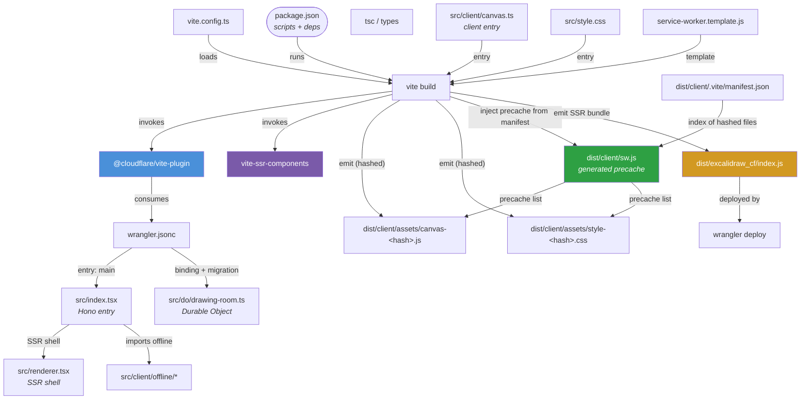

# excalidraw-cf — The Coupled Build System (write-up)

> Status: accurate as of branch `feat/offline-first`.
> This document captures how the build tooling is wired together — the entry
> points, the tools, and every coupling between them — so a new engineer (or an
> AI agent) can reason about what building, running, and deploying this app
> actually involves.

## TL;DR

This is **not a plain Vite SPA**. It's a **Cloudflare Worker** app (Hono + SSR +
Durable Objects) that happens to be bundled with Vite. The two Cloudflare-specific
Vite plugins make the build fundamentally coupled to `wrangler.jsonc`, the Durable
Object, and a server-side-rendered client bundle. A static host can serve the
built shell, but the product (rooms, persistence, real-time collaboration,
offline-first sync) lives in the Worker runtime and cannot run on a static host.

---

## 0. The build graph, at a glance

> Prefer a picture over prose? This Mermaid `graph TD` is the same system
> described below, laid out in one view. Read it top-to-bottom: **source config
> → build tooling → emitted artifacts → runtime.**



### Reading it

- **Config drives the build.** `package.json` scripts call `vite build`; `vite.config.ts`
  loads the two plugins; `@cloudflare/vite-plugin` reads `wrangler.jsonc` which names
  the backend entries (`src/index.tsx`, the Durable Object).
- **Two outputs come out of one build.** The **client bundle** (hashed `canvas-*.js`,
  `style-*.css`) for browsers, and the **SSR/worker bundle** (`dist/excalidraw_cf/index.js`)
  for Cloudflare.
- **The service worker precache is now *generated*.** `sw.js` is produced from
  `service-worker.template.js` by reading `dist/client/.vite/manifest.json`, so it
  always caches the real hashed files — never the dev-only `/src/...` source paths.

---

## 1. Toolchain and package manager

| Concern | Value |
|---|---|
| Runtime | **Node v26**, **Bun 1.4.2**, **npm 11.12.1** |
| Lockfiles | **Both** `bun.lock` and `package-lock.json` are git-tracked (dual-package-manager repo) |
| Effective PM for tests | npm |
| `$npm_execpath` | The package-manager CLI (npm or bun) that scripts recurse back into |

### The `$npm_execpath` trick

`package.json` scripts on this branch use the *bare, un-braced* `$npm_execpath`:

```jsonc
"preview": "$npm_execpath run build && vite preview",
"deploy":  "$npm_execpath run build && wrangler deploy"
```

Both npm and Bun set `$npm_execpath` to their own CLI path, so whichever package
manager invoked the script **recursively builds the project with itself** before
moving on to `vite preview` / `wrangler deploy`.

### Peer-dependency conflict (why `--legacy-peer-deps` is needed)

- `wrangler@^4.17.0` and `@cloudflare/vite-plugin@^1.2.3` peer-depend on
  `@cloudflare/workers-types` **v5**.
- This branch pins `@cloudflare/workers-types@^4.20260317.1`.
- npm 7+ strict peer resolution (ERESOLVE) fails without
  `npm install --legacy-peer-deps`. (A separate branch, `fix/npm-scripts-2026-09`,
  resolves this by bumping workers-types to v5 and quoting `$npm_execpath`; neither
  is present on this branch.)

---

## 2. Nodes — every component in the diagram

### Config / manifests (root)

| Node | Role |
|---|---|
| `package.json` | Manifest + scripts + dependency graph; `"type":"module"` |
| `$npm_execpath` (env var) | The package-manager CLI npm/bun |
| `vite.config.ts` | Bundles `@cloudflare/vite-plugin` + `vite-ssr-components/plugin` |
| `wrangler.jsonc` | Worker config: `main`, Durable Object binding, migrations, `$schema` |
| `config-schema.json` | JSON schema (`node_modules/wrangler/`) for `$schema` — IDE validation only |
| `tsconfig.json` | `types: ["vite/client", "@cloudflare/workers-types"]`, `jsx: "hono/jsx"` |
| `playwright.config.ts` | Test config + `webServer` boot of Vite dev on port 5199 |
| `.gitignore` | Ignores `dist/`, `dist-server/`, `node_modules/`, `.wrangler`, `test-results/` |

### Application entry points

| Node | Role |
|---|---|
| `src/index.tsx` | **Worker `main`**. Hono app: mounts renderer + routes + `/ws/:roomId` upgrade |
| `src/renderer.tsx` | `jsxRenderer` SSR shell; emits `<ViteClient/>`, `<Link>`→CSS, `<Script>`→canvas |
| `src/do/drawing-room.ts` | `DrawingRoom` Durable Object (SQLite + revision counter + REST/WS) |
| `src/routes/*` | `drawing.tsx`, `api.tsx`, `sse.tsx` |
| `src/lib/sse-helpers.ts` | Datastar SSE helpers |
| `src/types/env.ts` | `CloudflareBindings` for `new Hono<{Bindings}>()` |
| `worker-configuration.d.ts` | **Generated** by `wrangler types` (not yet present in this worktree) |

### Client bundle / static

| Node | Role |
|---|---|
| `src/client/canvas.ts` | **Client bundle entry** (referenced by `renderer.tsx` `<Script>`) |
| `src/client/offline/*` | Offline engine: sw-reg, connectivity, IndexedDB db, sync, offline-ui |
| `src/client/ws-client.ts` | WebSocket client + offline-first enqueue/live send |
| `src/style.css` | Global stylesheet |
| `public/sw.js` | Hand-written service worker (precache + cache-first shell) |

### Tools

| Node | Version / role |
|---|---|
| `vite` | v6.3.5 — bundler / dev server |
| `@cloudflare/vite-plugin` | v1.2.3 — Worker-in-Vite integration |
| `vite-ssr-components` | v0.5.2 — `ViteClient`/`Link`/`Script` SSR components |
| `wrangler` | v4.17.0 — CF CLI (`types`, `deploy`) |
| `hono` | v4.12.8 — web framework |
| `@starfederation/datastar` | ^1.0.0-beta.11 — client reactivity / SSE signals |
| `@playwright/test` | v1.63.0 — test runner / webserver |
| `@cloudflare/workers-types` | ^4 — global Worker types (peer-conflict source) |

---

## 3. The coupled build graph

A validated visual of the whole system is in **[Section 0 — The build graph](#0-the-build-graph-at-a-glance)** above. The graph there is the canonical view; the node tables in this section give the exact names and roles behind each node.

---

## 4. Entry points — the exact chain for each action

| Action | Chain |
|---|---|
| **`npm run dev`** | script → `vite` (config `vite.config.ts`), Worker runtime hosted by `@cloudflare/vite-plugin` reading `wrangler.jsonc` |
| **`npm run build`** | script → `vite build` (client + Worker bundle) |
| **`npm run preview`** | `$npm_execpath run build` → `vite preview` |
| **`npm run deploy`** | `$npm_execpath run build` → `wrangler deploy`, entry `./src/index.tsx` |
| **`npm run cf-typegen`** | `wrangler types --env-interface CloudflareBindings` → generates `worker-configuration.d.ts` |
| **`npm run test` / `npm run test:ui`** | `@playwright/test`, webServer boots `npm run dev -- --port 5199` |
| **SSR rendering** | `src/index.tsx` → `src/renderer.tsx` (`jsxRenderer` + `vite-ssr-components`) |
| **Client bundle entry** | `src/client/canvas.ts` (from `renderer.tsx` `<Script>`) |
| **Durable Object entry** | class `DrawingRoom` in `src/do/drawing-room.ts` |
| **Service worker** | `public/sw.js`, registered from `src/client/offline/service-worker.ts` |

---

## 5. Key couplings / caveats

1. **`worker-configuration.d.ts` is generated, not checked in here.** It only exists
   after `wrangler types` runs. `src/types/env.ts` (`CloudflareBindings`) is the
   checked-in manual equivalent used by the Hono generics, so the app type-checks
   even on a fresh checkout before `cf-typegen`.
2. **The `$npm_execpath` recursion is the core "coupled build" trick.** `deploy` and
   `preview` each run a recursive build through the same package manager first.
3. **The offline precache contract is a real directed edge.** `public/sw.js`
   hard-codes the *same asset routes* (`/`, `/src/style.css`, `/src/client/canvas.ts`)
   that `renderer.tsx` emits via `<ViteClient/>`/`<Link>`/`<Script>`. If the renderer's
   asset paths change, the service-worker precache must change in lockstep.
4. **Static-host limitation.** Because SSR + Durable Object + WebSocket + API routes
   all run in the Worker, you can extract `dist/` and host it statically, but the
   functional app (rooms, persistence, collaboration, offline sync) will not run
   there. See the README's offline-first section and the parent `ARCHITECTURE.md`.

---

*Generated from direct file inspection of the `feat/offline-first` worktree
(`/Volumes/4-TB/projects/stu-kennedy/excalidraw-cf-offline`).*
