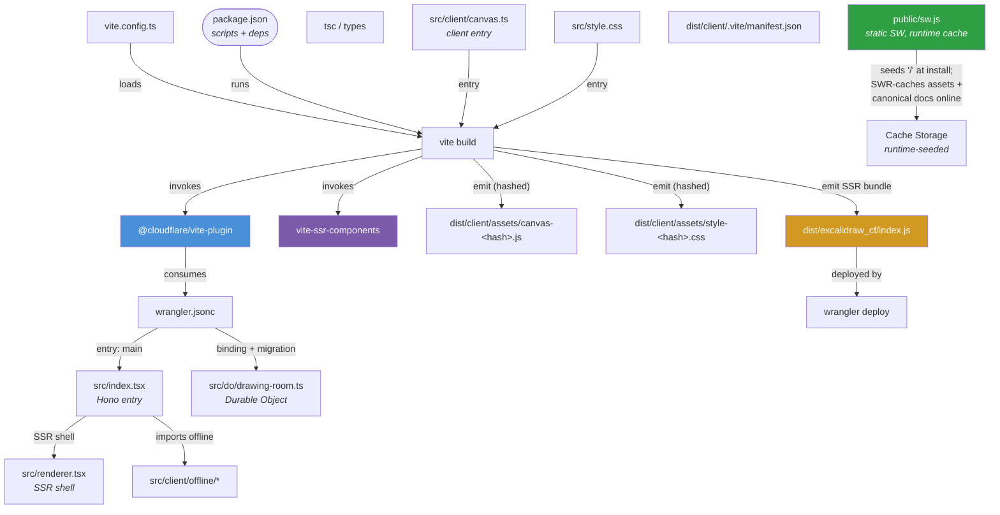
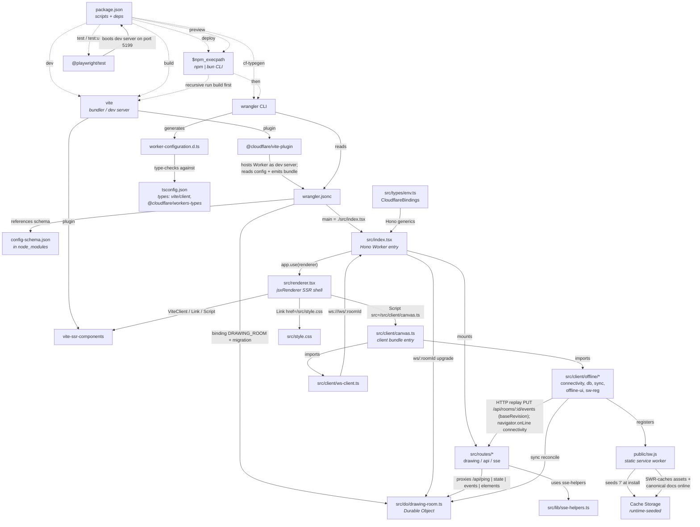

# excalidraw-cf — The Coupled Build System (write-up)

> Status: accurate as of branch `feat/offline-first`.
> This document captures how the build tooling is wired together — the entry
> points, the tools, and every coupling between them — so a new engineer (or an
> AI agent) can reason about what building, running, and deploying this app
> actually involves.

## TL;DR

This is **not a plain Vite SPA**. It's a **Cloudflare Worker** app (Hono + SSR +
Durable Objects) that happens to be bundled with Vite. The two Cloudflare-specific
Vite plugins make the build fundamentally coupled to `wrangler.jsonc`, the Durable
Object, and a server-side-rendered client bundle. A static host can serve the
built shell, but the product (rooms, persistence, real-time collaboration,
offline-first sync) lives in the Worker runtime and cannot run on a static host.

---

## 0. The build graph, at a glance

> Prefer a picture over prose? This Mermaid `graph TD` is the same system
> described below, laid out in one view. Read it top-to-bottom: **source config
> → build tooling → emitted artifacts → runtime.**



### Reading it

- **Config drives the build.** `package.json` scripts call `vite build`; `vite.config.ts`
  loads the two plugins; `@cloudflare/vite-plugin` reads `wrangler.jsonc` which names
  the backend entries (`src/index.tsx`, the Durable Object).
- **Two outputs come out of one build.** The **client bundle** (hashed `canvas-*.js`,
  `style-*.css`) for browsers, and the **SSR/worker bundle** (`dist/excalidraw_cf/index.js`)
  for Cloudflare.
- **The service worker is a committed static file with no build involvement.**
  `public/sw.js` builds its cache **at runtime**: install seeds the landing
  document `'/'`, successful online navigations are cached under their own URL
  (canvas-shaped pages additionally seed the roomless `/shell` canonical dummy),
  and hashed assets populate lazily via stale-while-revalidate as pages load.
  No precache list, no manifest reading — nothing for the build to inject.

---

## 1. Toolchain and package manager

| Concern | Value |
|---|---|
| Runtime | **Node v26**, **Bun 1.4.2**, **npm 11.12.1** |
| Lockfiles | **Both** `bun.lock` and `package-lock.json` are git-tracked (dual-package-manager repo) |
| Effective PM for tests | npm |
| `$npm_execpath` | The package-manager CLI (npm or bun) that scripts recurse back into |

### The `$npm_execpath` trick

`package.json` scripts on this branch use the *bare, un-braced* `$npm_execpath`:

```jsonc
"preview": "$npm_execpath run build && vite preview",
"deploy":  "$npm_execpath run build && wrangler deploy"
```

Both npm and Bun set `$npm_execpath` to their own CLI path, so whichever package
manager invoked the script **recursively builds the project with itself** before
moving on to `vite preview` / `wrangler deploy`.

### Peer-dependency conflict (why `--legacy-peer-deps` is needed)

- `wrangler@^4.17.0` and `@cloudflare/vite-plugin@^1.2.3` peer-depend on
  `@cloudflare/workers-types` **v5**.
- This branch pins `@cloudflare/workers-types@^4.20260317.1`.
- npm 7+ strict peer resolution (ERESOLVE) fails without
  `npm install --legacy-peer-deps`. (A separate branch, `fix/npm-scripts-2026-09`,
  resolves this by bumping workers-types to v5 and quoting `$npm_execpath`; neither
  is present on this branch.)

---

## 2. Nodes — every component in the diagram

### Config / manifests (root)

| Node | Role |
|---|---|
| `package.json` | Manifest + scripts + dependency graph; `"type":"module"` |
| `$npm_execpath` (env var) | The package-manager CLI npm/bun |
| `vite.config.ts` | Bundles `@cloudflare/vite-plugin` + `vite-ssr-components/plugin` |
| `wrangler.jsonc` | Worker config: `main`, Durable Object binding, migrations, `$schema` |
| `config-schema.json` | JSON schema (`node_modules/wrangler/`) for `$schema` — IDE validation only |
| `tsconfig.json` | `types: ["vite/client", "@cloudflare/workers-types"]`, `jsx: "hono/jsx"` |
| `playwright.config.ts` | Test config + `webServer` boot of Vite dev on port 5199 |
| `.gitignore` | Ignores `dist/`, `dist-server/`, `node_modules/`, `.wrangler`, `test-results/` |

### Application entry points

| Node | Role |
|---|---|
| `src/index.tsx` | **Worker `main`**. Hono app: mounts renderer + routes + `/ws/:roomId` upgrade |
| `src/renderer.tsx` | `jsxRenderer` SSR shell; emits `<ViteClient/>`, `<Link>`→CSS, `<Script>`→canvas |
| `src/do/drawing-room.ts` | `DrawingRoom` Durable Object (SQLite + revision counter + REST/WS) |
| `src/routes/*` | `drawing.tsx`, `api.tsx`, `sse.tsx` |
| `src/lib/sse-helpers.ts` | Datastar SSE helpers |
| `src/types/env.ts` | `CloudflareBindings` for `new Hono<{Bindings}>()` |
| `worker-configuration.d.ts` | **Generated** by `wrangler types` (not yet present in this worktree) |

### Client bundle / static

| Node | Role |
|---|---|
| `src/client/canvas.ts` | **Client bundle entry** (referenced by `renderer.tsx` `<Script>`) |
| `src/client/offline/*` | Offline engine: sw-reg, connectivity, IndexedDB db, sync, offline-ui |
| `src/client/ws-client.ts` | WebSocket client + offline-first enqueue/live send |
| `src/style.css` | Global stylesheet |
| `public/sw.js` | Committed static service worker (runtime canonical-document cache) |

### Tools

| Node | Version / role |
|---|---|
| `vite` | v6.3.5 — bundler / dev server |
| `@cloudflare/vite-plugin` | v1.2.3 — Worker-in-Vite integration |
| `vite-ssr-components` | v0.5.2 — `ViteClient`/`Link`/`Script` SSR components |
| `wrangler` | v4.17.0 — CF CLI (`types`, `deploy`) |
| `hono` | v4.12.8 — web framework |
| `@starfederation/datastar` | ^1.0.0-beta.11 — client reactivity / SSE signals |
| `@playwright/test` | v1.63.0 — test runner / webserver |
| `@cloudflare/workers-types` | ^4 — global Worker types (peer-conflict source) |

---

## 3. The coupled build graph

This is the fuller **coupling-focused** view. It differs from **Section 0** like this:

- **Section 0** is the *lean, output-oriented* view — "what the build emits." The
  service worker is deliberately **not** part of the build: it is a committed
  static file whose cache is populated at runtime (see Section 0's "Reading it").
- **Section 3** is the *coupling-oriented* view — "how everything talks to
  everything." The important extra it captures is the **`$npm_execpath` recursive
  build**: `deploy`/`preview` first re-invoke the package manager to build, *then*
  hand off to wrangler / `vite preview`. That self-reference is the core reason
  this build is called "coupled," and it is only visible here.

> Parse note: Mermaid chokes on `$` inside a quoted edge label (`got 'STR'`).
> The graph below keeps `$` only inside **node** definitions (which render fine)
> and avoids it in **edge** labels.



---

## 4. Entry points — the exact chain for each action

| Action | Chain |
|---|---|
| **`npm run dev`** | script → `vite` (config `vite.config.ts`), Worker runtime hosted by `@cloudflare/vite-plugin` reading `wrangler.jsonc` |
| **`npm run build`** | script → `vite build` (client + Worker bundle) |
| **`npm run preview`** | `$npm_execpath run build` → `vite preview` |
| **`npm run deploy`** | `$npm_execpath run build` → `wrangler deploy`, entry `./src/index.tsx` |
| **`npm run cf-typegen`** | `wrangler types --env-interface CloudflareBindings` → generates `worker-configuration.d.ts` |
| **`npm run test` / `npm run test:ui`** | `@playwright/test`, webServer boots `npm run dev -- --port 5199` |
| **SSR rendering** | `src/index.tsx` → `src/renderer.tsx` (`jsxRenderer` + `vite-ssr-components`) |
| **Client bundle entry** | `src/client/canvas.ts` (from `renderer.tsx` `<Script>`) |
| **Durable Object entry** | class `DrawingRoom` in `src/do/drawing-room.ts` |
| **Service worker** | committed static `public/sw.js` (copied verbatim to `dist/client/sw.js`), registered from `src/client/offline/service-worker.ts` |

---

## 5. Key couplings / caveats

1. **`worker-configuration.d.ts` is generated, not checked in.**

   `wrangler types` (the `cf-typegen` script) *writes* `worker-configuration.d.ts`
   out of the **current `wrangler.jsonc`** — so it reflects whatever bindings exist
   in your config *right now*. Several things follow from that:

   - **It's a build/typegen artifact, not source.** It's normally gitignored and
     regenerated on demand. It is the *compiler-facing* view of the Worker's
     `Bindings` that TypeScript needs in order to treat `c.env.DRAWING_ROOM` as
     a real typed namespace.
   - **`worker-configuration.d.ts` and `src/types/env.ts` are two ways to name the
     same thing.** `env.ts` spells `CloudflareBindings` by hand; the generated file
     is the authoritative version produced by `wrangler`. They must stay in step —
     if you change a binding in `wrangler.jsonc`, you either re-run `cf-typegen`
     (regenerating the d.ts) or edit `env.ts` by hand. Keeping `env.ts` checked in
     means the app still type-checks on a fresh checkout *before* anyone runs
     `cf-typegen`, which is why it's the manual default here.

2. **The `$npm_execpath` recursion is the core "coupled build" trick.** `deploy` and
   `preview` each run a recursive build through the same package manager first.

3. **The offline cache is runtime-seeded, not build-injected.** The service
   worker is a committed static file (`public/sw.js`) with no precache list and
   no Vite-plugin involvement. At install it caches only the landing document
   `/`; while online, every successful navigation is cached under its own URL,
   canvas-shaped pages additionally seed the roomless `/shell` canonical dummy,
   and assets (hashed chunks in prod, `/src/*.ts` dev modules in dev) enter the
   cache via stale-while-revalidate as pages load. Versioning is a manual
   `CACHE_VERSION` constant — bump it, and the old cache is deleted on activate.
   The build's only role is copying `public/` through as-is.

4. **"Offline" needs a careful nuance — the app is *mostly* frontend, not all-or-nothing.**

   It is **not** true that "nothing works offline." Once the shell + client bundle
   are cached, **the whole drawing experience is frontend-only**: the canvas,
   IndexedDB storage, the outbox queue, and the sync/fork logic in
   `src/client/offline/*` all run in the browser with no server at all.

   What genuinely *requires* the server is **live collaboration** — the WebSocket.
   If you're offline (or the Worker is unreachable), you miss **real-time updates
   from other users** (their new/moved/deleted elements won't arrive), and they
   won't see yours until you reconnect and the outbox drains. Single-user drawing,
   loading, saving, and offline-queueing all work fully client-side.

   The real, precise blocker is therefore **reachability of the canvas itself**:
   the landing and room pages are server-rendered, so getting to `/d/:roomId` at
   all is the coupling that actually matters — which is exactly the layering the
   `feat/offline-first` branch was built to solve. See "What next" below.

### What next — making offline *reachable*

The offline layer already handles the *hard part* (edits, IndexedDB, sync, fork).
The gap is purely that the *route to the canvas* currently comes from the server.
Options, roughly in increasing effort:

1. ~~**Rely on the service-worker navigation fallback.**~~ **IMPLEMENTED** — the
   SW's navigation handler is *network-first* with a route-aware offline
   fallback: `/d/:roomId`, `/new` and `/join` fall back to the cached `/shell`
   canvas document (everything else to the cached landing page).
2. ~~**Precache the room route(s).**~~ **SUPERSEDED by the runtime canonical-
   document model** — no build-time precache exists anymore. `/shell` (same
   `DrawingPage` SSR, no roomId) is the canonical roomless dummy, cached at
   runtime by the SW: any successful canvas-shaped navigation seeds it, so
   real online usage warms exactly the documents offline boots need. The
   client derives the real room from `location.pathname` at boot
   (`src/client/canvas.ts` mints `/new` rooms and resolves `/join?room=X`
   offline), so the cached document's embedded SSR signal is inert.
3. **Prerender the shell from the build** instead of at request time (move the
   SSR template from `renderer.tsx` into static HTML during `vite build`). This is
   the bigger architectural move: it removes the server from the *page-delivery*
   path entirely, leaving the server only for the API + WebSocket that truly need it.

Any of these would let a user "get to canvas" offline — making the layer of
indirection around `canvas.ts` that `feat/offline-first` added actually reachable.

---

*Generated from direct file inspection of the `feat/offline-first` worktree
(`/Volumes/4-TB/projects/stu-kennedy/excalidraw-cf-offline`).*
