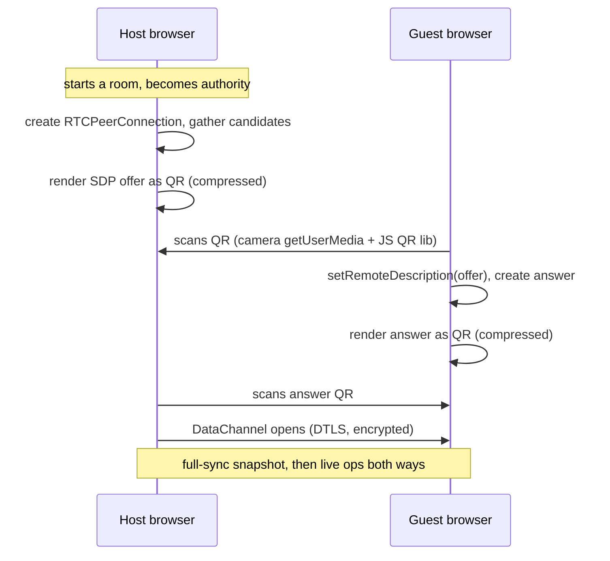
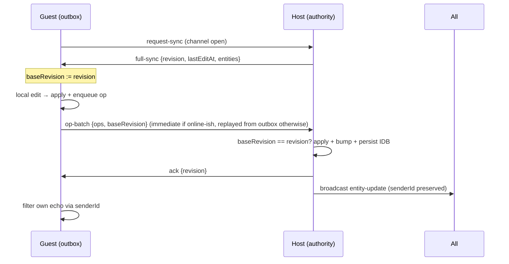
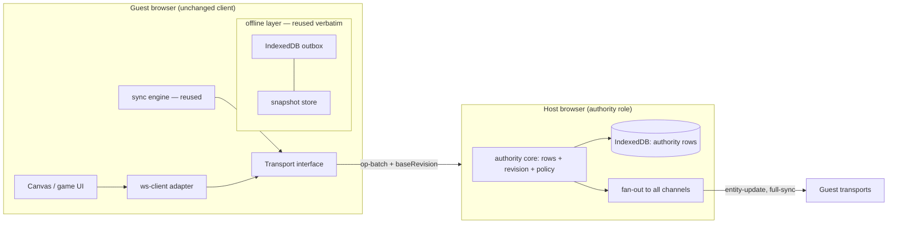
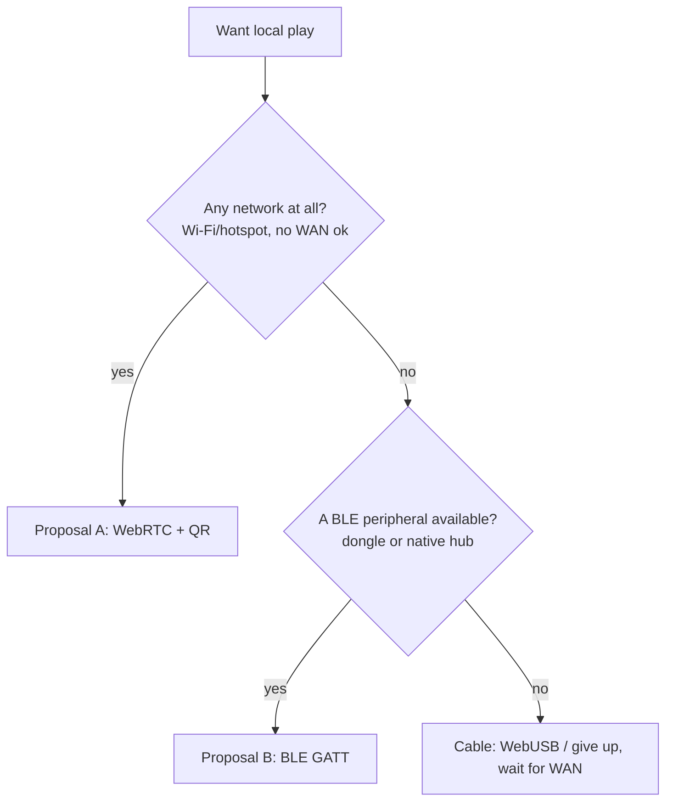

# Experiments — sans-internet local play across browsers

> **Status:** proposal. Nothing here is implemented; this document exists to
> make the ideas testable before any code is written.
>
> **Companion doc:** [README.md](./README.md) — extracting the collaboration
> layer for other client-side apps. This file assumes that extraction: the
> whole thesis is that the **offline outbox + revision + fork** machinery is
> transport-blind, so the "server" in a local game can be *another browser*.

---

## 1. The problem statement

The parent app already survives **no internet**: the service worker boots the
app shell offline, IndexedDB holds the state, and the outbox replays on
reconnect. But "reconnect" always means *waiting for the WAN to come back*.

The gaps left open:

- **Two people, one room, zero connectivity.** Two laptops on a train, two
  phones at a campsite, a classroom with the Wi-Fi down. The outbox gives each
  of them a private copy — but nothing lets them *share a room* with each
  other until the internet returns.
- **Turn-based games want a peer, not a cloud.** A chessboard between two
  neighbors does not need Cloudflare in the middle; it needs *a channel*.

**The goal:** play together, offline, across two or more browsers/devices —
with no internet, no router, and ideally no installed app. Keep every
protocol, conflict rule, and UX habit already built.

**Non-goals:** real-time action netcode (60Hz), voice/video, multiplayer with
strangers on the internet, replacing the Cloudflare backend for normal use.
This is an *additional* transport for the same room protocol, not a fork of the
app.

---

## 2. The central insight that makes this cheap

The collaboration layer's conflict machinery is **transport-blind**:

- The outbox logs ops *before* any send (`ws-client.ts` → `enqueue`).
- Reconciliation is `PUT /events` with `baseRevision` → `synced | diverged`.
- Divergence → fork, never merge.

None of that cares whether the endpoint is a Durable Object over HTTPS or
another tab over a radio. The sync engine just needs *an endpoint*. So the
experiment is really:

> **Elect one browser as the room's authority ("host"), run the same
> reconciliation logic there (IndexedDB as the row store, a JS revision
> counter instead of `ctx.storage`), and expose the same three operations over
> a local radio: fetch snapshot, submit ops with baseRevision, stream
> fan-out.**

The host browser plays the Durable Object's role:

| Durable Object role | Local-host equivalent |
|---|---|
| `ctx.storage.sql` rows | IndexedDB `authority` store in the host tab |
| `ctx.storage.put('revision')` | A variable + IDB write in the host |
| WebSocket `broadcast()` | DataChannel / BLE characteristic notifications |
| `/state` GET | Snapshot request over the radio |
| `/events` PUT | Op-batch + `baseRevision` over the radio |
| Isolate eviction | Host tab closed — see §8, the handover problem |

And because `OfflineOp = MutationMessage` derives the outbox from the protocol,
**the local outbox replays against a browser host unchanged.** That coupling,
documented in the parent README as the anti-drift trick, is what pays off here.

---

## 3. The radio landscape (honest feasibility matrix)

"Sans-internet" still needs *a* radio. Here is the full menu, with the
browser-platform truth attached.

| Transport | Bandwidth | Latency | Range | Browser support | Topology | Verdict |
|---|---|---|---|---|---|---|
| **WebRTC DataChannel over LAN/mDNS** | ~Mbps | ~ms | Wi-Fi range | ✅ all browsers | Many-to-many | **Primary** — see §4 |
| **WebRTC DataChannel, no network at all** | — | — | — | ✅ but needs *an* IP path | — | ❌ dead air = dead radio |
| **Web Bluetooth (BLE GATT)** | ~KB/s (chunked writes) | 10–100ms+ | ~10m | ⚠️ Chrome/Edge only (no Safari/iOS, no Firefox) | Central↔peripheral only | **Secondary** — see §5 |
| **Web USB (cable)** | Mbps | ms | 1 cable | ⚠️ Chrome/Edge | 1:1 | Niche fallback, great for demos |
| **Web NFC** | ~KB | ~100ms | <4cm | ⚠️ Chrome Android only | 1:1 tap | Bootstrap gimmick, not a transport |
| **Web MIDI** | small | low | cable/peripheral | ⚠️ Chrome | 1:1 | Novelty; no |
| **Service Worker "local server"** | — | — | — | ❌ same-origin tab fetches only | — | ❌ cannot accept cross-device connections |
| **BroadcastChannel/SharedWorker** | fast | fast | same browser | ✅ | cross-tab only | Useful *for the host tab architecture* (§6), not cross-device |

Two structural truths drive everything below:

1. **A browser can never listen for incoming TCP connections.** No browser
   binds a socket. So "one device serves HTTP to the other over LAN" is
   impossible from pure web code — this is *why* WebRTC (which uses
   connectivity checks instead of listening) and BLE-peripheral (which needs
   the browser to *offer* a GATT server, which it doesn't in stable builds)
   are the only real radios.
2. **Web Bluetooth in a browser is central-only.** Stable Chrome can *connect
   to* BLE peripherals; it cannot *be* one. Two stock browsers therefore
   cannot BLE-talk directly to each other — something must be the peripheral
   (§5.3's dongle, or a device running a native peripheral app).

---

## 4. Proposal A (primary): WebRTC DataChannel + proximity signaling

### 4.1 Why it wins

- It is the **only** option with real bandwidth (a chessboard moves kilobytes;
  a shared canvas pushes strokes at ~tens/sec — both trivial for a
  DataChannel) and ~millisecond latency.
- It works in **every** modern browser — Safari, Firefox, Chrome, iOS, Android.
- On a LAN it needs **no STUN/TURN/signaling server at all**: host candidates
  (the device's own IP) and mDNS `.local` candidates resolve locally. Data
  channels are always DTLS-encrypted, so no extra crypto work.

The unsolved part of WebRTC has never been the data path — it's **signaling**
(exchanging SDP offers/answers). On the internet you'd use a signaling server;
sans-internet, the signaling must ride *proximity*: sight, tap, cable, or a
local bootstrap. That is the actual design problem, addressed next.

### 4.2 Signaling without a server: the QR handshake

**Trust model as a feature:** whoever can *see the QR* is in the room. The QR
is simultaneously the discovery mechanism, the invitation, and (via the SDP
fingerprint inside it) the MITM protection. Physical presence replaces the
auth server.

Flow (two-device case; N devices repeat step 2):



**Making SDP fit in a QR:** a raw offer with ICE candidates is 1–4KB — too
chunky for one QR (~3KB max, and screen-glare wants ≤1.2KB). Mitigations, all
standard practice:

1. Wait for candidate gathering to finish, then **trim** the SDP to essentials.
2. Deflate + base64url. SDP compresses ~60%.
3. If still oversized, **animated QR frames** (a chunk sequence rendered as a
   flipping QR; the scanner reassembles by frame index). The QR library is the
   same for encode and decode; both sides have a camera on phones, and on
   laptops the joiner can also use a second screen / manual paste fallback.

**Fallback ladder (in-UI, in order of desperation):**

| Tier | Mechanism | Works when |
|---|---|---|
| 1 | Auto: mDNS/local-candidate exchange via a *local* bootstrap page served by any device on the LAN (e.g. a laptop running the dev server on Wi-Fi — still no WAN needed) | A LAN exists |
| 2 | QR handshake (above) | Any camera on either side |
| 3 | Copy-paste SDP blobs between devices | Always, clunky |
| 4 | Proposal B (BLE) or cable | No network at all |

### 4.3 Host election

Simplest rule, zero protocol: **whoever creates the room is the host** (they
show the QR). Guests never elect; a guest joining a room always targets the QR
they scanned. Election algorithms (bully/raft-over-DataChannel) are a
tempting rabbit hole with no payoff at 2–4 devices. The failure mode "host
leaves" is handled as *handover*, not election — see §8.

### 4.4 Message flow after the handshake



This is *byte-for-byte* the existing reconciliation, with `fetch()` swapped for
the channel. The guest keeps: IndexedDB outbox, dirty flag, divergence UX. The
host keeps: row upserts with version checks, tombstones, revision bumps,
`senderId` echo semantics.

---

## 5. Proposal B (secondary): Web Bluetooth — the true no-infrastructure path

Web Bluetooth matters because it works when **there is no network of any
kind** — airplane, hiking, a faraday-cage game jam. That is a real scenario the
WebRTC proposal cannot cover, and it is worth engineering for *eyes open*:

### 5.1 The constraints, stated plainly

- **Support:** Chrome/Edge on desktop + Android. No iOS Safari. No Firefox.
  This alone makes it a fallback, not the primary.
- **Topology:** the browser is a **BLE central only**. Stable browsers cannot
  advertise a GATT server. Therefore *browser↔browser direct BLE is not
  possible* — something must be the peripheral.
- **Throughput:** GATT writes are chunked (default ATT MTU 20–23 bytes until
  negotiation; practical sustained rate tens of KB/s at best). Fine for
  chess moves, cursor positions at ~5Hz, small text. Wrong for canvas
  strokes — a single freedraw polyline would need multi-KB chunking, and
  latency (~60–100ms connection intervals) makes strokes feel rubber-banded.
- **UX friction:** `requestDevice()` requires a user gesture and shows a
  chooser; HTTPS (secure context) required — the service worker precache
  already gives us the app shell, and the page can be served once then used
  offline forever.
- **No broadcast discovery:** the JS API is connect-and-subscribe; there is no
  background scan of arbitrary advertisements (scanning is experimental and
  gated).

### 5.2 What BLE *is* good for here

- A **tiny-op turn-based game** (chess: one move ≈ 40–80 bytes chunked to 2–4
  writes) is genuinely viable at ~100ms/op — slower than a human's impatience
  but faster than a human's turn thought.
- A **presence beacon**: "someone with this app is nearby" before any WebRTC
  handshake.

### 5.3 Three ways to bridge the central-only gap

| Option | How | Cost/feasibility |
|---|---|---|
| **The room dongle (recommended experiment)** | An ESP32 (~$5) runs a small GATT peripheral service: a writable op characteristic, a notify characteristic for fan-out. It is the *authority* (or a dumb repeater to the elected central). Firmware is ~200 lines (Arduino/NimBLE) | Real hardware; rock-solid demo; the "room" becomes a physical object you put on the table |
| **A native-app hub** | One device (phone) runs a tiny native peripheral-mode app implementing the same characteristic contract | Defeats "pure browser," but great for the iOS-Safari gap: iPhone runs the hub, iPads/Macs (Chrome) join |
| **Chrome experimental GATT-server** | Historically behind `chrome://flags` experimental web platform features | Not shippable; track as a maybe, never a dependency |

**Protocol over GATT (the dongle contract):**

- Service UUID: app-specific (one UUID per app/protocol-version).
- `op` characteristic (write, chunked): `op-batch {ops, baseRevision}` JSON,
  framed as `[seq:u8][total:u8][payload...]`, reassembled by the reader.
- `notify` characteristic: server messages (`entity-update`, `full-sync`,
  `user-joined`), same framing.
- `revision` characteristic (read): the room revision for cheap divergence
  checks without a full snapshot.
- The dongle *can* implement the full authority role (SQLite-less: NVS/LittleFS
  row store, revision counter) or operate in **repeater mode**: it relays
  between BLE clients and the elected browser-host (Proposal A architecture on
  a device that has Wi-Fi but no WAN). Repeater mode is the pragmatic default —
  firmware stays dumb, all authority logic lives in the browser host.

### 5.4 Why BLE is proposal B, not the main line

Every limitation compounds: two-browser gap, platform coverage, throughput,
gesture-gated pairing. It is the *right* answer only for "no radios at all,"
and even there a USB cable (WebUSB, Chrome-only, 1:1) is a simpler story for
two laptops side by side. Build the dongle as a **demo-grade experiment** (§10,
Phase 3), not as product infrastructure.

---

## 6. The architecture both proposals share



The only genuinely new code:

1. **`Transport` implementations** — `WebRtcTransport`, `BleTransport`
   (chunking/framing), both exposing `send(msg)` / `onMessage(cb)`.
2. **`AuthorityHost`** — the DO's persistence + reconciliation logic as a plain
   TS class, minus Cloudflare. Its unit tests can run in Node against a fake
   IndexedDB; the DO and the browser host should be able to *share this class*
   eventually (that is the parent README's §10 step 3 made concrete).
3. **Signaling UI** — QR render/scan + the copy-paste fallback.
4. **A `ws-client` variant** whose "is connected" truth comes from the
   transport instead of `WebSocket.readyState`, and whose reconnect policy
   follows the repo's recorded design principle (`navigator.onLine` trusted for
   *network* truth; local-transport health judged by the channel itself).

Everything else — outbox shape, revision checks, fork modal, optimistic
apply-local-first, `senderId` echo filtering — ships as-is. **That is the
whole payoff of the parent extraction: the local-play experiment becomes a
thin radio driver, not a second collaboration engine.**

---

## 7. Gaming on this: what local play enables

- **Turn-based anywhere (Tier A from the parent README):** chess, cards, word
  games. The outbox even allows *asymmetric offline play*: each player makes
  moves offline; when the radios meet, one side syncs, the other diverges and
  forks. For two players, soften fork → "adopt host state" per the parent
  README's chess note.
- **Shared cursors/pieces at party latency:** DataChannel handles live drag at
  LAN latency; BLE handles 5Hz presence pings.
- **The demo that sells it:** two laptops, Wi-Fi off, QR handshake, a shared
  chessboard with move validation (the parent README's §7 hook running in the
  *host browser* instead of the DO), and mid-game disconnect/reconnect proving
  the outbox caught the missed turns.

---

## 8. The hard problems (naming them before they bite)

1. **Host handover.** The authority is a browser tab; closing it ends the
   room's truth. Options: (a) refuse — show "host left; last state saved
   locally, new QR to resume" (simplest, honest); (b) transfer — host streams
   its rows + revision to an electee before unload (`pagehide` is unreliable;
   treat as best-effort); (c) *both guests* fork from their own outboxes into a
   fresh room (reuses existing fork UX wholesale). Recommend (a) for v1, (c)
   as the documented recovery story.
2. **Clock/turn ownership.** With no server clock, wall-clock timestamps are
   unreliable — two editors writing at the same moment collide, and skew
   scrambles order. A naive timestamp tie-breaker is how LWW bugs are born, so
   the room `revision` stays the authority for room sequence and `turnIndex`
   (not time) decides turns. But for *per-event identity and tie-breaking*, a
   coordination-free time-ordered id works: **UUIDv7** (48-bit ms timestamp +
   random suffix, RFC 9562) keeps same-millisecond edits distinct and sorts
   lexicographically ≈ chronologically. Mint entity ids as UUIDv7 from day one
   of local play — it costs nothing now and makes later fork-merging
   deterministic (see the parent README §5, "Ordering").
3. **Room identity without URLs.** Rooms are found by QR/proximity. Room ids
   should be minted by the host and *embedded in the QR payload* so the guest
   outbox targets the same room id the host knows.
4. **Security.** WebRTC: DTLS + SDP fingerprint via QR ⇒ strong as the QR's
   privacy (shoulder-surfing is the attack; mitigate with rotating rooms).
   BLE: the dongle firmware must enforce bonded/encrypted characteristics, or
   accept that anyone in range can attempt writes (gate ops on an
   out-of-band room token written first).
5. **Multiple transports, one room.** A game might mix WebRTC guests and a BLE
   guest via repeater mode. The authority core doesn't care (ops in, fan-out
   out), but *divergence* is per-peer: each peer keeps its own
   `baseRevision`. This falls out naturally — the outbox already tracks base
   revision per room; make the host track it **per transport session**.
6. **Backpressure.** BLE needs write pacing (queue + `characteristicvaluechanged`
   drain); DataChannel needs ordered-vs-unordered decisions ordered for ops,
   unordered for presence.

---

## 9. Platform support summary

| Capability | Chrome/Edge desktop | Chrome Android | Safari macOS | iOS Safari | Firefox |
|---|---|---|---|---|---|
| WebRTC DataChannel | ✅ | ✅ | ✅ | ✅ | ✅ |
| getUserMedia QR scan | ✅ | ✅ | ✅ | ✅ (camera) | ✅ |
| Web Bluetooth central | ✅ | ✅ | ❌ | ❌ | ❌ |
| Web Bluetooth peripheral | ❌ (experimental only) | ❌ | ❌ | ❌ | ❌ |
| WebUSB | ✅ | ✅ | ❌ | ❌ | ❌ |
| Web NFC | ❌ | ✅ | ❌ | ❌ | ❌ |

Reading: **Proposal A is universal; Proposal B is a Chrome-only specialty.**
Ship them in that order.

---

## 10. Phased roadmap

**Phase 1 — prove the authority abstraction (no new radio).**
Run two tabs in *one browser* with a `BroadcastChannel` transport. Same
protocol, same outbox, zero plumbing risk. Exit criteria: divergence + fork
works between tabs; the `AuthorityHost` class passes the parent README's §11
test list against a fake transport.

**Phase 2 — WebRTC + QR handshake.**
Two real devices on a Wi-Fi-less LAN (phone hotspot without WAN works — the
hotspot is a LAN with no internet). Deliverables: `WebRtcTransport`,
QR encode/scan UI, fallback paste flow. Exit criteria: two laptops play the
turn-based demo with Wi-Fi WAN disabled; disconnect/reconnect drains outboxes.

**Phase 3 — BLE dongle experiment.**
ESP32 firmware (repeater mode first, authority mode second), `BleTransport`
with chunking, chess-sized ops only. Explicitly timeboxed as a *demo*; write
the support matrix on the demo page so nobody mistakes it for a feature.

**Phase 4 (stretch) — merge into the extracted kit.**
`AuthorityHost` graduates into the parent README's §4 package as a second
server implementation; the DO and the browser host share the reconciliation
class. Demos live under `docs/reusability/collaboration/demos/`:

```
demos/
├── tab-to-tab/          # Phase 1: BroadcastChannel, pure browser
├── qr-webrtc/           # Phase 2: two-device LAN play
├── ble-dongle/          # Phase 3: firmware + pairing page
└── chess-local/         # the turn-based showcase binding it together
```

Each demo: a README with setup, a single-page demo, and the Playwright-style
manual checklist (the repo's offline test steps are the template).

---

## 11. Risks & honest unknowns

- **QR SDP size** may exceed single-frame QR even compressed; animated QR adds
  real complexity. De-risk in Phase 2 day one; paste-fallback keeps the demo
  unblocked regardless.
- **iOS Bluetooth absence** is permanent (Apple will not ship Web Bluetooth);
  the only iOS path is WebRTC or the native-hub option.
- **mDNS candidate quirks**: some corporate/guest Wi-Fi networks block
  peer-to-peer traffic (client isolation). The hotspot-without-WAN and home
  router cases are fine; conference Wi-Fi may not be. This is why the
  radio-less fallbacks exist.
- **Battery/radio instability** on BLE (connections drop silently);
  `gattserverdisconnected` handling and the outbox make recovery boring —
  which is exactly the point of the architecture.
- **Scope creep into netcode.** The moment someone asks for real-time action
  play, the honest answer stays: this substrate is Tier A/B (parent README
  §9); Tier C needs different literature.

---

## 12. TL;DR

- Sans-internet multiplayer is *achievable now* because the offline layer is
  transport-blind: outbox + revision check + fork don't care that the
  "server" is another tab.
- **Primary: WebRTC DataChannel with QR-based signaling** — universal browser
  support, real bandwidth, encrypted by default, trust via physical proximity.
- **Secondary: Web Bluetooth via a small peripheral (ESP32 dongle)** — the
  only true zero-network path, limited to Chromium, fine for turn-sized ops.
- Everything new is a *transport driver*; the collaboration brain is already
  written, tested, and documented in this repo.

---

## Appendix: diagram drafts

Diagrams to be rendered as images under `docs/reusability/collaboration/assets/`
when the demos land (kept as Mermaid here so they stay reviewable in-source):

1. **Radio decision tree**



2. **Authority handover options** — sequence diagram of option (c): both
   peers fork from local outboxes into a fresh room after host loss.

3. **BLE framing** — the chunked-write frame `[seq][total][payload]` and the
   reassembly state machine.