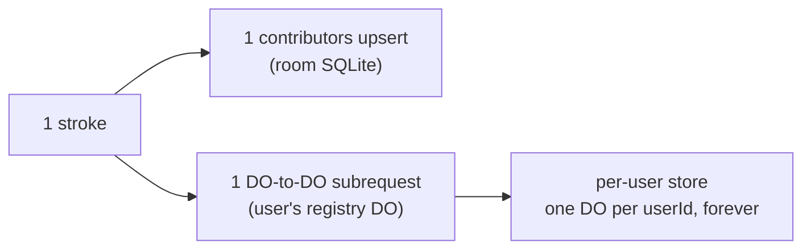
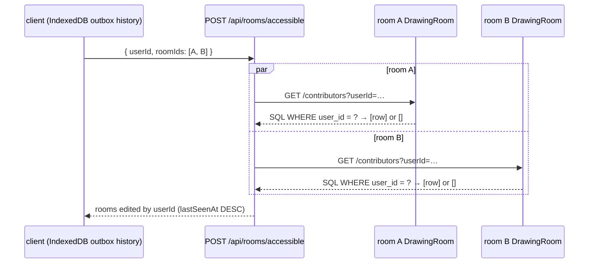

# Write amplification — attribution in the room, not in a registry

> Status: accurate as of the post-registry design (`v2`). This is the
> amplification ledger for edit attribution: what each edit costs now, what
> the old per-user registry design cost, and what amplification remains
> by design.

## TL;DR

Attribution used to pay a DO-to-DO subrequest on **every stroke** and
materialize one store per user. It now costs exactly **one idempotent local
SQLite upsert per edit**, in the room the edit happened — O(1) per stroke,
zero subrequests, no per-user store. Cross-room "rooms you've edited" is a
separate read that fans out only to the rooms the client names.

## The problem with the v1 design

The v1 design attributed every edit through a per-user `RoomRegistry` Durable
Object: every mutation did **1 room-local `contributors` upsert + 1 DO-to-DO
subrequest** to that user's registry DO. With `N` strokes by `U` users across
`R` rooms, the aggregate attribution cost grew with the cross product of
users and rooms:



- **Per-edit subrequests**: every stroke paid a subrequest — added latency and
  cost that scaled per stroke, not per room.
- **Unbounded store population**: one registry DO materialized per `userId`,
  entirely separate from the rooms holding the actual edits — stores that
  persist even for users who never draw again.
- **Cross-user listing fan-outs**: "rooms you've edited" went through those
  per-user stores, fanning out across users and rooms.

## Why per-user DO sharding was rejected

- It makes collaboration *harder*: a subrequest per edit is latency + cost on
  the hottest path in the app (drawing), scaling per stroke.
- It explodes the storage surface into an archipelago of per-user stores
  separate from rooms.
- It buys **nothing** in an unauthenticated capability model: room URLs are
  the capability, and the client already knows its own room URLs — a
  server-side per-user index adds no security or capability the client
  doesn't already hold.

## The v2 design (current)

Attribution is one idempotent local upsert **in the room the edit happened**
(`do/drawing-room.ts`, `recordContributor`):

```sql
INSERT OR REPLACE INTO contributors (user_id, last_seen_at) VALUES (?, ?)
```

- Primary key `user_id` ⇒ last-writer-wins: N strokes by one user = 1 row.
- O(1) per stroke regardless of how many users or rooms exist.
- Zero subrequests; no per-user store ever materializes.
- The `contributors` table rides the room's own SQLite
  (`new_sqlite_classes: ["DrawingRoom"]`) — no extra DO, no extra binding,
  and the wrangler migration list stays at `v1`.
- Fire-and-forget on hot paths (live WS writes, `PUT /elements`); awaited
  before the divergence check on the offline replay path (`PUT /events`).

## Cross-room listing: POST /api/rooms/accessible

"Rooms you've edited" is a **read**, not a write. The client supplies its own
candidate `roomIds` (from its IndexedDB outbox history via `db.listRooms()`),
and the server fans out to each room's DO `/contributors` route, passing
`?userId=` so the filter happens in each room's SQL (`WHERE user_id = ?`):



The read is proportional to **rooms checked**, never to a room's popularity:
a room with 10,000 contributors answers the probe with one indexed row.

## Residual amplification ledger (honest)

The design did not eliminate all write amplification; this remains, by design:

| Residual | Cost | Bound |
|---|---|---|
| Periodic 3s `flushAll` `PUT /elements` (`client/canvas.ts` interval) | full-element write path every 3s while a room is open | one room, client-side timer |
| Offline drain replay | ops replayed per room on reconnect | one batch per room (`POST /api/sync/drain`, 20-room cap) |
| `/accessible` DO materialization | probing an unknown roomId spins up an empty DO + empty SQLite | 100 roomIds per request; real clients send only their own IndexedDB history |
| `/accessible` read fan-out | one DO fetch per requested roomId | proportional to `roomIds` supplied — **not** to contributors-per-room, since the `?userId=` filter is pushed into each room's SQL |